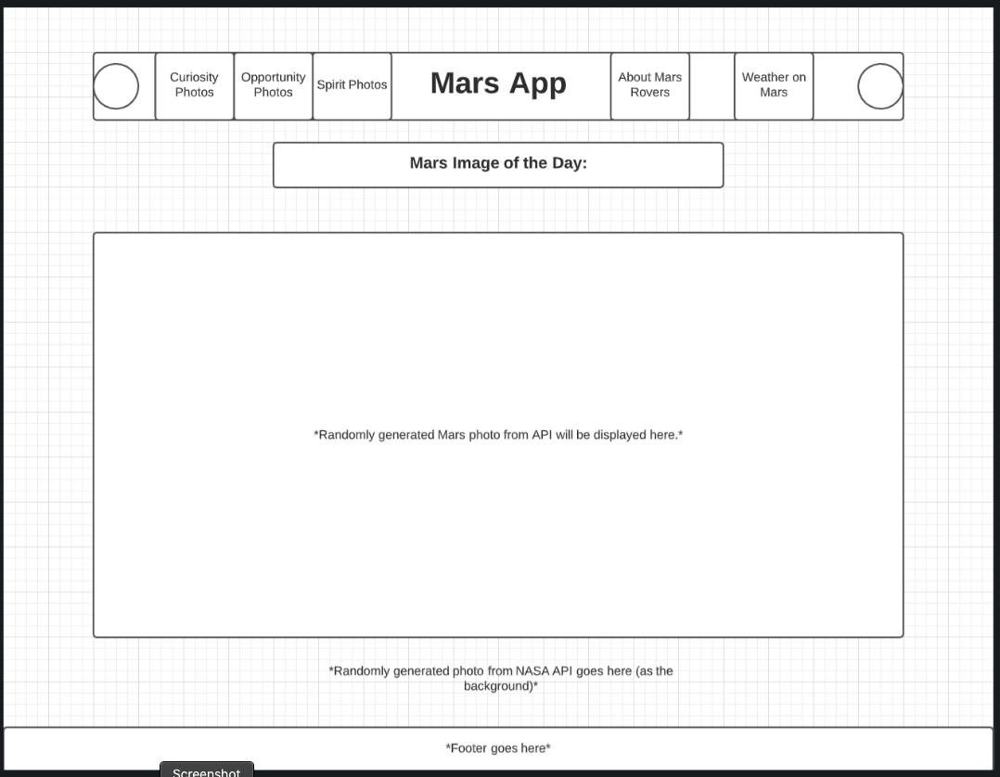
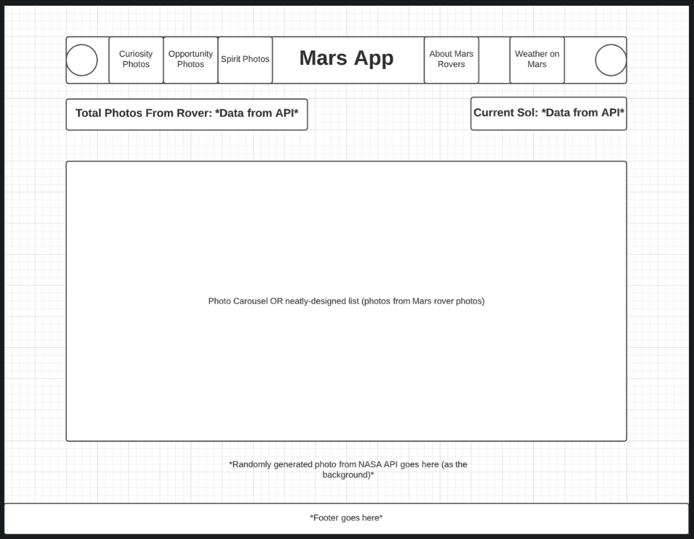
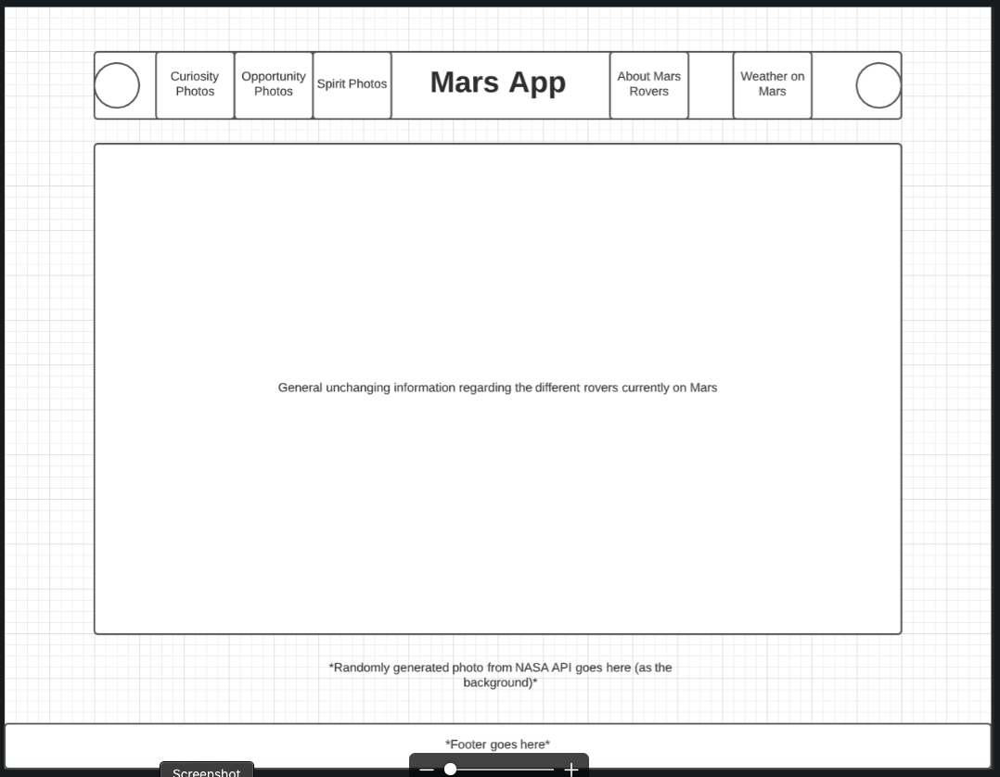
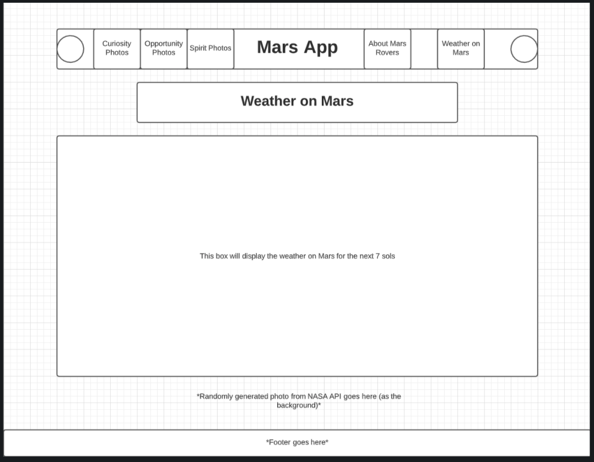
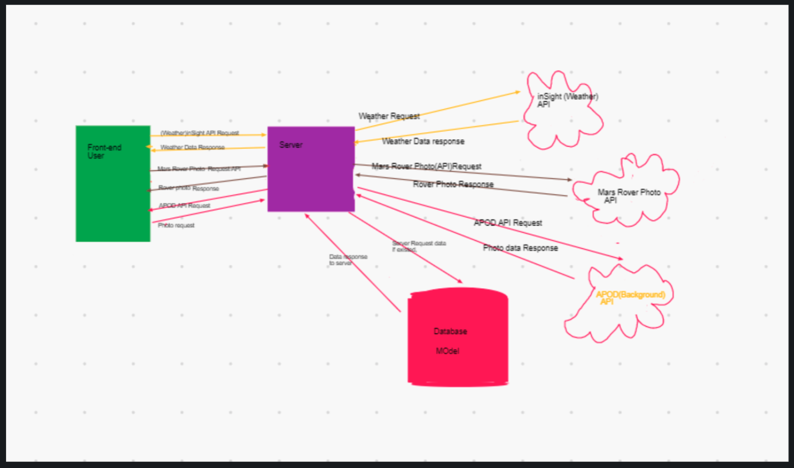
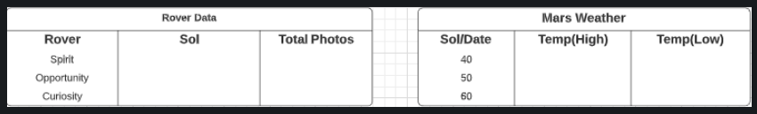

# Mars-App

## Sean Hawkins, Nick Dorkins, Nebiyu Kifle, Cody Carpenter

Summary of idea.

We want to create a site all about Mars because we are out of this world. On the home page, we want the homepage header to be generated from the random Mars photo API. In addition, we want to make the background photo populate from APOD (Astronomy pic of the day). Moreover, we would like to create a navigation to a separate page that will generate Mars weather data (per sol). Potential part of our app: photos separated by the rover that took them.

What problem or pain point does it solve? a. Keep it high level without going into too much detail. (3-4 sentences is enough)

Although this does not solve any crisis’s, it is important that people have access to the latest Mars images and weather data. To the little boy that dreams of becoming an astronomer, to the older gentleman just figuring out the web, this app is for everyone. We believe that our site will inform and inspire the youth of the World.

Minimum Viable Product (MVP) definition.

When users navigate to our site, they will see a random Mars photo generated on the home banner and a random photo from NASA as the background image. When a user navigates to the Mars Weather page, they will be able to see the weather on Mars for the next 7 Sols.

What is the minimum required for you to present on your demo day?

Minimum required is to have the random photos generate in high quality, as well as have the weather data displayed in a presentable fashion (we may spend extra time afterwards refining the visual presentation of weather).

APIs: NASA APIs:

- Mars Rover Photos

- InSight

- APOD

---

## User Stories

As a User:

- I want a clean looking user friendly app.
- I want to be up to date on the most recent images from the Surface of Mars. 
- I want to option of viewing images from a specific rover. (Curiosity, Opportunity, Spirit)
- I want to know what the weather is like daily on the surface of Mars.
- I want to be able to save my favorite photos and come back to them later.

As a Developer:

- I want to supply the user with an application that is easy to navigate with clearly labeled links.
- I want to have the most recent images that are in the NASA database from the surface of Mars. (disclaimer that tells the user that these images come in packages and are not updated daily)
- I want to provide access to all of the weather data so that the user can look at the different sols and see weather trends.
- I to allow the user to be able to access images from specific rovers on the surface of Mars.
- I want the user to be able to store images in a database and be able to recall them later. 

## Wireframes

## Domain Modeling

## Entity Relationship Diagram

The Entity Relationship Diagram tables are not related, but are both for the same app.